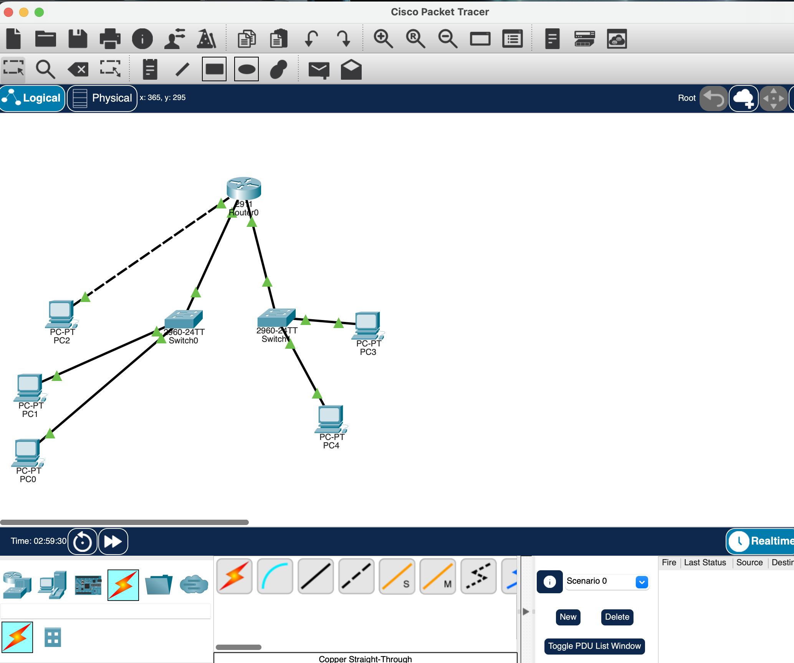

# Multi-LAN Enterprise Network Topology & Routing Lab

A foundational Cisco Packet Tracer lab demonstrating multi-subnet IP routing, Layer 2 frame switching, baseline IOS security configurations, and standard cabling conventions.

## 📌 Project Overview
This lab simulates a multi-branch corporate topology featuring three distinct subnets connected via a central Cisco router. It demonstrates end-to-end connectivity, proper cable selection (MDI vs. MDIX), static IP schema design, and CLI security hardening.

## 📐 Network Topology


### Addressing & Device Table
| Device | Interface | Connected To | IP Address | Subnet Mask | Default Gateway | Cable Type |
| :--- | :--- | :--- | :--- | :--- | :--- | :--- |
| **PC0** | Fa0 | Switch0 (Fa0/1) | 192.168.1.10 | 255.255.255.0 (/24) | 192.168.1.1 | Straight-Through |
| **PC1** | Fa0 | Switch0 (Fa0/2) | 192.168.1.11 | 255.255.255.0 (/24) | 192.168.1.1 | Straight-Through |
| **PC2** | Fa0 | Router R1 (Gi0/1) | 10.1.1.10 | 255.255.255.0 (/24) | 10.1.1.1 | **Crossover** |
| **PC3** | Fa0 | Switch1 (Fa0/1) | 172.16.1.10 | 255.255.255.0 (/24) | 172.16.1.1 | Straight-Through |
| **PC4** | Fa0 | Switch1 (Fa0/2) | 172.16.1.11 | 255.255.255.0 (/24) | 172.16.1.1 | Straight-Through |
| **R1** | Gi0/0<br>Gi0/1<br>Gi0/2 | Switch0 (Fa0/24)<br>PC2 (Fa0)<br>Switch1 (Fa0/24) | 192.168.1.1<br>10.1.1.1<br>172.16.1.1 | 255.255.255.0 (/24)<br>255.255.255.0 (/24)<br>255.255.255.0 (/24) | N/A | Straight-Through<br>Crossover<br>Straight-Through |

---

## 🛠️ Key Technical Concepts Applied

1. **Structured IP Schema Design:**
   * **` .1 ` Gateways:** First usable IP reserved for router interfaces across all subnets.
   * **` .2 – .9 ` Infrastructure Block:** Reserved for static infrastructure (SVIs, printers, APs).
   * **` .10+ ` Host Pool:** Assigned to workstations and end-user endpoints.
   * **Classless Subnet Masking (CIDR):** Overrode default Class B masks (`255.255.0.0`) to uniform `/24` (`255.255.255.0`) masks to align broadcast domains.

2. **Cabling Conventions (MDI vs. MDIX):**
   * **Straight-Through Cables:** Applied to *unlike devices* (Switch to Router, Switch to Host).
   * **Crossover Cables:** Applied to *like devices* (Router to Host), accounting for MDI-to-MDI end-host physical pinouts without relying on default Auto-MDIX.

3. **Layer 2 vs. Layer 3 Protocol Operations:**
   * **Layer 2 (Frame Switching):** Local traffic forwarding via MAC addresses and switch MAC address tables.
   * **Layer 3 (Packet Routing):** Cross-subnet traffic forwarding via router IP routing tables and ARP address resolution.

---

## ⚙️ Baseline Cisco IOS Configuration

### Router Security & Hostname Setup
```text
enable
configure terminal
hostname R1
enable secret Cisco123!
line console 0
 password ConsolePass123!
 login
 exit
